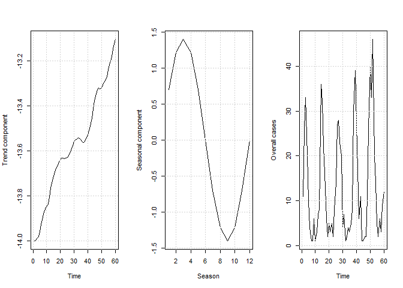
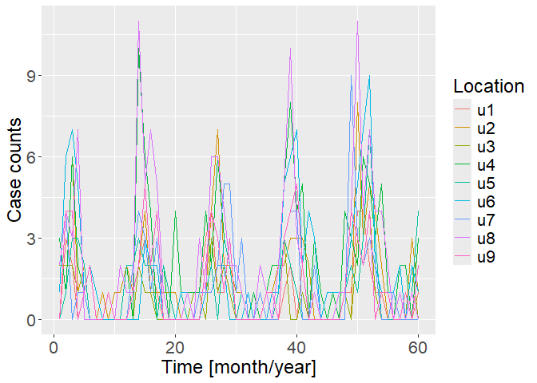

<!-- README.md is generated from README.Rmd. Please edit that file -->

# DetectOutbreaks

<!-- badges: start -->
<!-- badges: end -->

DetectOutbreaks is created to implement a novel and efficient approach
to the analysis of spatio-temporal models presented in [(Adeoye et al.,
2025)](https://arxiv.org/abs/2503.01456). The package is built with
different functionalities including model simulations, Bayesian
inference methods, model comparison methods, plotting of results, etc.
To reproduce the results presented in our paper, please refer to
[reproduce_results](https://github.com/Matthewadeoye/DetectOutbreaks/blob/master/inst/scripts/reproduce_results.R).

# Dependencies

<!-- badges: start -->
<!-- badges: end -->

DetectOutbreaks depends on Stan through its R interface, cmdstanr. If
not already installed, you can do so using

``` r
install.packages("cmdstanr", repos = c("https://mc-stan.org/r-packages/", getOption("repos")))
library(cmdstanr)
install_cmdstan()
```

## Installation

You can install the development version of DetectOutbreaks from
[GitHub](https://github.com/) with:

``` r
# install.packages("devtools")
devtools::install_github("Matthewadeoye/DetectOutbreaks")
```

## Simulation, visualization, inference, and outbreak detection.

An example showing how to simulate and plot space-time data from model-0
described in [(Adeoye et al., 2025)](https://arxiv.org/abs/2503.01456):

``` r
library(DetectOutbreaks)
#> 
#> Attaching package: 'DetectOutbreaks'
#> The following object is masked from 'package:stats':
#> 
#>     simulate
sim_adjmat<- matrix(0, nrow = 9, ncol = 9)
uppertriang<- c(1,0,1,0,0,0,0,0,1,0,1,0,0,0,0,0,0,1,0,0,0,1,0,1,0,0,1,0,1,0,0,0,1,1,0,1)
gdata::upperTriangle(sim_adjmat, byrow=TRUE)<- uppertriang
gdata::lowerTriangle(sim_adjmat, byrow=FALSE)<- uppertriang
set.seed(0); TRUTHS<- simulate(Model = 0, time = 60, adj.matrix = sim_adjmat)
sim.plot(sim.object = TRUTHS)
```





Inference using either Hamiltonian Monte Carlo or a bespoke MCMC
algorithm via DetectOutbreaks:

``` r
#HMCfit<- infer(y = TRUTHS[[1]], e_it = TRUTHS[[2]], Model = 0, adjmat = sim_adjmat, Stan = TRUE, ModEvid = TRUE, OutbreakProb = FALSE)
#mcmc.plot(HMCfit)
#inf.plot(HMCfit)

#MCMCfit<- infer(y = TRUTHS[[1]], e_it = TRUTHS[[2]], Model = 0, adjmat = sim_adjmat, Stan = FALSE, ModEvid = TRUE, OutbreakProb = FALSE)
#mcmc.plot(MCMCfit)
#inf.plot(MCMCfit)
```

Simulation, inference and outbreak detection as described in [(Adeoye et
al., 2025)](https://arxiv.org/abs/2503.01456):

``` r
library(DetectOutbreaks)
sim_adjmat<- matrix(0, nrow = 9, ncol = 9)
uppertriang<- c(1,0,1,0,0,0,0,0,1,0,1,0,0,0,0,0,0,1,0,0,0,1,0,1,0,0,1,0,1,0,0,0,1,1,0,1)
gdata::upperTriangle(sim_adjmat, byrow=TRUE)<- uppertriang
gdata::lowerTriangle(sim_adjmat, byrow=FALSE)<- uppertriang
set.seed(0); TRUTHS1<- simulate(Model = 1, time = 60, adj.matrix = sim_adjmat)
#sim.plot(sim.object = TRUTHS1)
#HMCfit1<- infer(y = TRUTHS1[[1]], e_it = TRUTHS1[[2]], Model = 1, adjmat = sim_adjmat, Stan = TRUE, ModEvid = TRUE, OutbreakProb = FALSE)
#mcmc.plot(HMCfit1)
#inf.plot(HMCfit1)
#MarginalProbabilities<- OutbreakProbability(y = TRUTHS1[[1]], e_it = TRUTHS1[[2]], inf.object = HMCfit1, adjmat = sim_adjmat, Model = 1)
#image(t(MarginalProbabilities))

#MCMCfit1<- infer(y = TRUTHS1[[1]], e_it = TRUTHS1[[2]], Model = 1, adjmat = sim_adjmat, Stan = FALSE, ModEvid = TRUE, OutbreakProb = FALSE)
#mcmc.plot(MCMCfit1)
#inf.plot(MCMCfit1)
#MarginalProbabilities<- OutbreakProbability(y = TRUTHS1[[1]], e_it = TRUTHS1[[2]], inf.object = #MCMCfit1, adjmat = sim_adjmat, Model = 1)
#image(t(MarginalProbabilities))
```

Compute model evidence (or log marginal likelihood) through importance
sampling Monte Carlo simulations for any model fitted by
DetectOutbreaks:

``` r
library(DetectOutbreaks)
sim_adjmat<- matrix(0, nrow = 9, ncol = 9)
uppertriang<- c(1,0,1,0,0,0,0,0,1,0,1,0,0,0,0,0,0,1,0,0,0,1,0,1,0,0,1,0,1,0,0,0,1,1,0,1)
gdata::upperTriangle(sim_adjmat, byrow=TRUE)<- uppertriang
gdata::lowerTriangle(sim_adjmat, byrow=FALSE)<- uppertriang
set.seed(0); TRUTHS1<- simulate(Model = 1, time = 60, adj.matrix = sim_adjmat)
#HMCfit1<- infer(y = TRUTHS1[[1]], e_it = TRUTHS1[[2]], Model = 1, adjmat = sim_adjmat, Stan = TRUE, ModEvid = FALSE, OutbreakProb = FALSE)
#ModelEvidence(y = TRUTHS1[[1]], e_it = TRUTHS1[[2]], adjmat = sim_adjmat, Model = 1, inf.object = HMCfit1, num_samples = 50000)

#MCMCfit1<- infer(y = TRUTHS1[[1]], e_it = TRUTHS1[[2]], Model = 1, adjmat = sim_adjmat, Stan = FALSE, ModEvid = FALSE, OutbreakProb = FALSE)
#ModelEvidence(y = TRUTHS1[[1]], e_it = TRUTHS1[[2]], adjmat = sim_adjmat, Model = 1, inf.object = MCMCfit1, num_samples = 50000)
```
